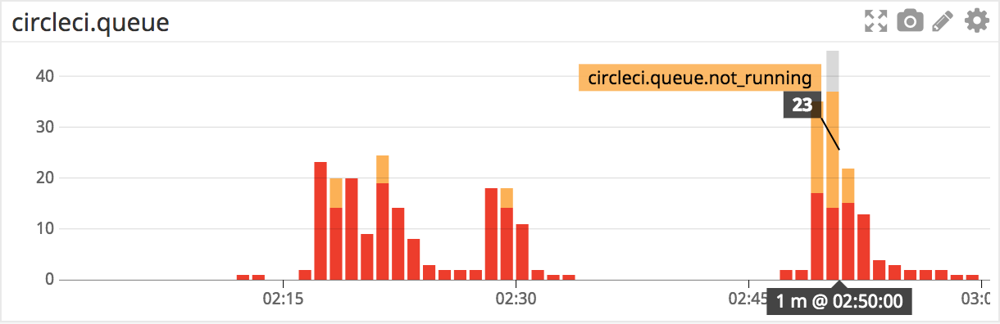

# circleci-queue-to-datadog

Monitor CircleCI queue and save it as Datadog metrics.

With the metric data, you can create dashboards like this on Datadog:



## Prerequisites

* CircleCI API Token
  * Create new personal token from https://circleci.com/account/api
  * You need to follow all of the projects to monitor by the owner of the token
* Datadog API Key
  * Create API key from https://app.datadoghq.com/account/settings#api

## Run

### go get

```
$ go get github.com/yuya-takeyama/circleci-queue-to-datadog
$ CIRCLECI_API_TOKEN=<CircleCI API Token> DATADOG_API_KEY=<Datadog API Key> circleci-queue-to-datadog
```

### Docker

```
$ docker run -e CIRCLECI_API_TOKEN=<CircleCI API Token> -e DATADOG_API_KEY=<Datadog API Key> yuyat/circleci-queue-to-datadog
```

## Options

* `--usernames=USERNAMES`
  * Comma-separated list of usernames to check queue
* `--intervals=N`
  * Interval to check CircleCI queue in seconds
  * Default: 60
